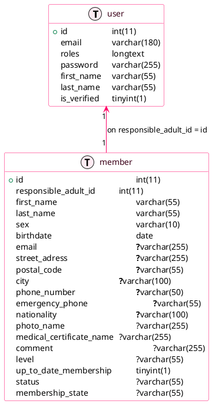
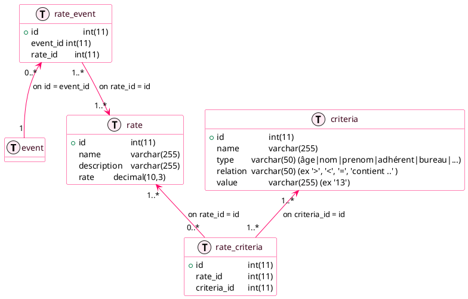
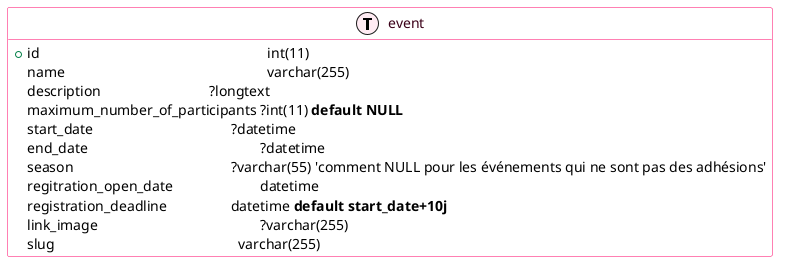

# Cahier des charges #

## site d'inscription - Taekwonkido Phénix ##

### Objectif ###
créer un site en php/mysql (avec le framework symfony) pour permettre aux élèves de s'inscrire pour adhérer au club. Le site devra permettre le paiement en ligne. 
A terme le site devra aussi permettre l'inscription aux différents événements (stage, passage de grade, repas, déplacement, …)

### Description ###

#### Adhésion (pour devenir adhérent au club) ####

On appellera "utilisateur" une personne qui souhaite s'inscrire au club ou inscrire ses enfants. L'utilisateur aura un compte pour accéder au site.
On appellera "adhérent" toute personne inscrite au club

- Le site doit permettre aux utilisateurs souhaitant adhérer de s'inscrire au club via un formulaire d'inscription.
- L'utilisateur doit pouvoir se créer un compte au site pour lui permettre de s'inscrire lui-même (s'il est adulte) ou d'inscrire ses enfants (s'il est parent)
- son compte lui permet de voir l'état d'avancement de son adhésion (en cours, payé, en attente validation, validée)
- le formulaire de création de compte doit demander les informations suivantes : nom, prénom, email, mot de passe
- le formulaire d'adhésion doit demander les informations suivantes : nom, prénom, email, date de naissance, sexe, rue, code postal, ville, nationalité, téléphone, téléphone en cas d'accident, photo, certificat médical, grade, professeur, membre du bureau
- ensuite, le formulaire d'inscription doit proposer les différents tarifs accessibles (en fonction de ce qui aura été configuré) et permettre le paiement en ligne
- Par défaut, les nom/prénom de la 1ère inscription correspondent aux nom/prénom de l'utilisateur
- ensuite, par défaut les nom/prénoms/adresse/email/tel/tel_accident des autres inscriptions sont ceux de la 1ère inscription
- Un utilisateur doit pouvoir voir les inscriptions des saisons passées, pour pouvoir réinscrire facilement les mêmes personnes
- ~~Les adhérents sont enregistrés dans la table membre avec le champs adhérent positionné à yes et la saison est correctement renseignée~~
- ~~La saison vaut N-N+1 si 01/04/N < date < 31/03/N+1 (ex si 01/04/2022 < date < 31/03/2023 => saison = '2022-2023')~~
- les champs obligatoires sont nom, prénom, date de naissance, sexe, rue, code postal, ville, nationalité, téléphone, certificat médical, grade (peut être 'aucun')
- les champs optionnels sont email, téléphone en cas d'accident, photo
- Avant les adhésions, l'administrateur doit déclarer un événement de type 'adhésion' qui sera enregistré dans la table des événements. Le champs season sert à déterminer la saison. Il sera de la forme N-N+1 (ex 2022-2023)
- ensuite, l'administrateur détermine les tarifs associés à l'adhésion, selon certains critères (cf plus bas)
- C'est seulement lorsque l'adhésion et les tarifs ont été fixés que l'inscription sera possible (tant qu'on respecte le champs regitration_open_date)
- Lorsqu'un utilisateur adhère au club, il faut insérer une ligne dans la table member, puis renseigner la table event_member avec la date de souscription. C'est le champs event.season qui sert à déterminer si une personne est adhérent ou non (s'il existe une ligne dans member et event_member et event et event.season = saison-actuelle)
- Pour les évenements qui ne sont pas des adhésion, le champs season est vide

#### Accès au back-office - rôles ####
Il doit y avoir un système de rôles pour accéder au back-office :
- administrateur (accès en lecture/écriture)
- consultation (accès en lecture)
- adhérent (aucun accès)

les administrateurs ont tout pouvoir : 
- création/suppression/modification des utilisateurs
- création/suppression/modification des adhérents
- configurer les tarifs
- configurer les événements

#### Tarifs ####
Les tarifs doivent être configurables par un administrateur pour une saison donnée ou un événement.
La saison court du 01/09/N au 31/08/N+1
habituellement :
- tarif enfant (jusqu'à 12 ans)
- tarif adulte (à partir de 13 ans)
- tarif "ancien élève enfant"
- tarif "ancien élève adulte"
- possibilité de payer en 3x
- réduction possible pour certaines catégories d'élèves (ex : anciens élèves) 

Les adhésions sont possible du 01/06 au 01/12 (les dates doivent être configurables)

#### Vision des adhérents dans le back-office ####
Les administrateurs doivent pouvoir créer/supprimer/modifier des adhérents.
Il faudrait que le tableau soit configurable, c'est-à-dire qu'on puisse rajouter des colonnes en fonction des besoins : exemple "commande dobok", "commande passeport", …

## Architecture base de données ##
une table membre
- adherentId
- lastname
- firstname
- sex
- birthdate
- email
- street
- postalCode
- city
- nationality
- phone
- emergencyPhone
- status (élève, président, trésorier, secrétaire, professeur, assistant)
- adhesionState (en attente paiement, en attente validation, validée)
- medicalCertificate
- Photo
- comment
- grade
- instructor (est-ce que l'adhérent est professeur ou pas) NULL par défaut
- bureau (est-ce que l'adhérent est membre du bureau ou pas) NULL par défaut
- season (ex : 2021-2022; 2022-2023; ...)
- adherent (yes/no) : oui si la personne est adhérente au club, non, sinon (ex personne extérieure au club)

état de l'adhésion : 
- en attente de paiement : lorsque l'utilisateur a inscrit un adhérent mais pas encore payé
- en attente validation : lorsque le paiement est ok et on attend la validation du bureau (pour vérifier les pièces du dossier comme le certificat médical)
- validée : le dossier est complet

Un user peut être responsable de 1 à N adherents

## Etape 2 - Tarification
Il faut pouvoir proposer des tarifications en fonction de certains critères basés sur l'âge, le grade, le nom, le prénom, si on est adhérent ou pas, ...
Le système de tarification sera utilisable aussi bien pour les adhésions que pour les inscriptions aux événements

le type de critère 'âge' se détermine par rapport à l'âge de l'élève.
Par exemple : âge > 13

le type de critère grade se détermine par rapport au grade
Par exemple : grade = '1er keup'; grade > '1er dan'

le type de critère adhérent se détermine par rapport au champ adhérent
Par exemple : si adhérent ou non

le type de critère profresseur se détermine par rapport au champ 'instructor' de l'élève
Par exemple : si professeur ou non

le type de critère bureau se détermine par rapport au champ 'bureau' de l'élève
Par exemple : si 'membre du bureau' ou non

Un tarif sera accessible en fonction de certains critères. Un tarif peut avoir besoin de plusieurs critères (ex : enfant gradé)

## Etape 3 - inscriptions aux événements ##
Dans un 2ème temps, il faudrait donner la possibilité de s'inscrire à différents événements (stage, compétition, passage de grade, déplacement, repas, …) et de payer en ligne avec des tarifs configurables

- Les utilisateurs peuvent inscrire aux évenements des adhérents au club ou des personnes extérieures (ex patinoire)
- Les personnes extérieures au club seront enregistrées dans la table membre avec le champs adherent à 'no'
- le formulaire d'inscription doit demander les informations suivantes : nom, prénom, email, date de naissance, sexe, commentaire
- les champs obligatoires sont nom, prénom, date de naissance
- les autres champs sont optionnels
- Le champs season est valorisé à NULL pour les événements

## Etape 4 - améliorer le front-office pour un faire le site principal du club ##
Améliorer le front-office pour y intégrer le site actuel https://phenix.cenaclerm.fr et pourquoi pas le faire en Wordpress ? A voir

